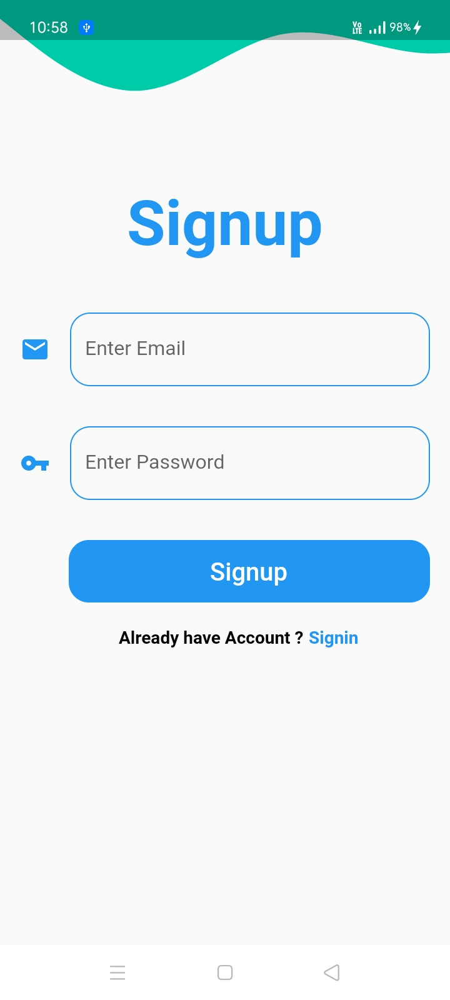
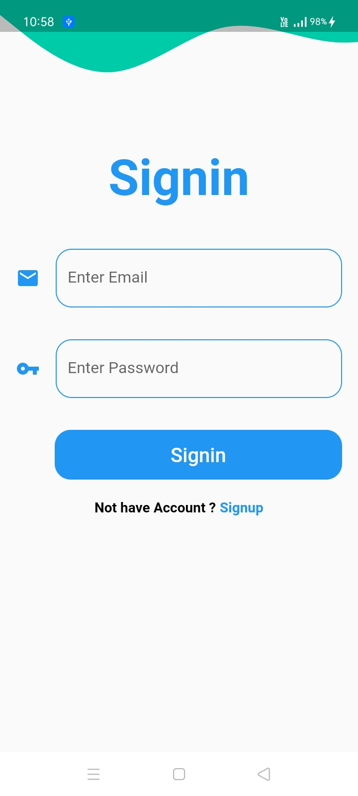

# Flutter-User
#### This is a Flutter application with user authentication with <a href="https://nodejs.org/en/">NodeJS</a>., <a href="https://expressjs.com/">ExpressJS</a> and <a href="https://www.mongodb.com/">MongoDB</a> as backend.

***

<p>


</p>

***
## Installing:- 
<h4>Clone the Repository by copying the following commands on your terminal/bash.</h4>

 ```Javascript
    git clone https://github.com/vaibhavmantri/instagram-clone.git 
 ```

<h4>Or simply Download .zip file and run the following commands in your terminal/bash/shell</h4>
<h3>Frontend</h3>


```
   flutter run
```
<h3>Backend</h3>


```
   npm install
```

<h3> APK(For android)</h3>
<h4>Download the APK fron the link below</h4>
```

```
<h4>This will install all the dependencies which are required for the above project to run in your system</h4>

***

<br>

### Building the Project

<strong>Install</strong>

```
npm install
```


### Prerequisites

<li /><a href="https://flutter.dev/docs" />Flutter
<li /> <a href="https://nodejs.org/en/docs/" /> nodejs v6.11.3 or later

***

### Libraries Used

<li /> <a href="https://expressjs.com/" />ExpressJS
<li /> <a href="https://docs.mongodb.com/manual/" />MongoDB
<li /> <a href="https://material-ui.com/" />Material UI
<li /> <a href="https://www.npmjs.com/package/cors" />Cors
<li /> <a href="https://www.npmjs.com/package/express-router" /> Express Router
<li /> <a href="https://fonts.google.com/" />Google Fonts

***

### To-DO
<li /> Excryption in Password(uuid)
<li /> Dashboard Design